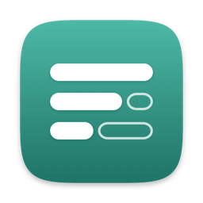
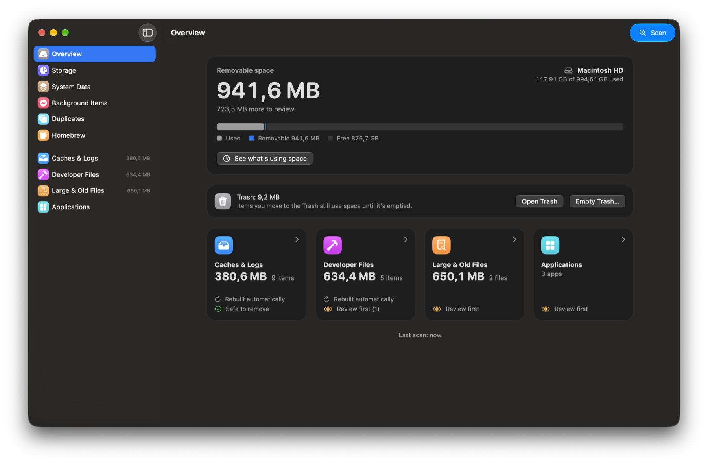
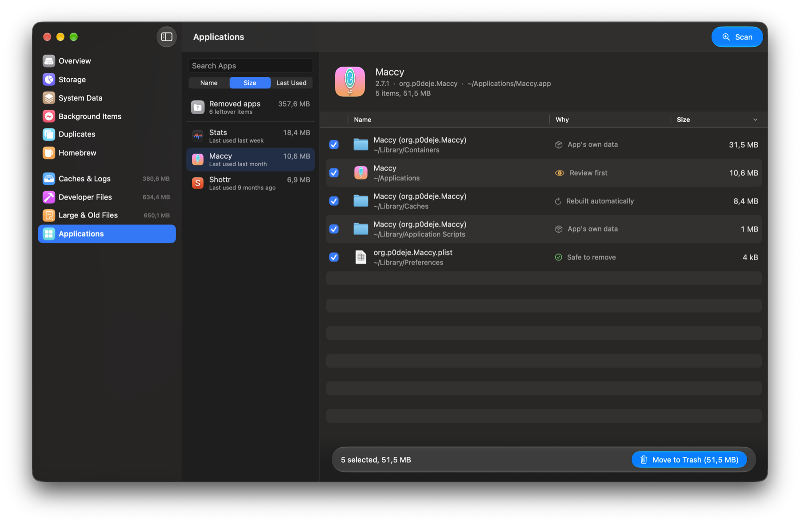
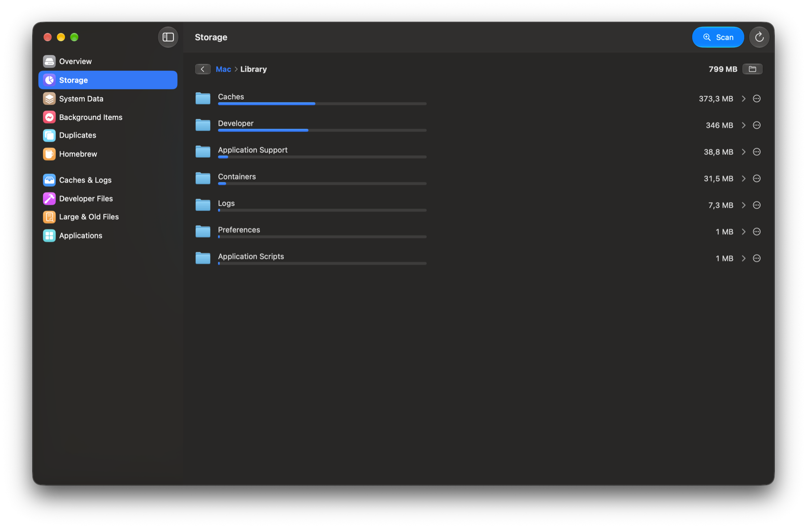
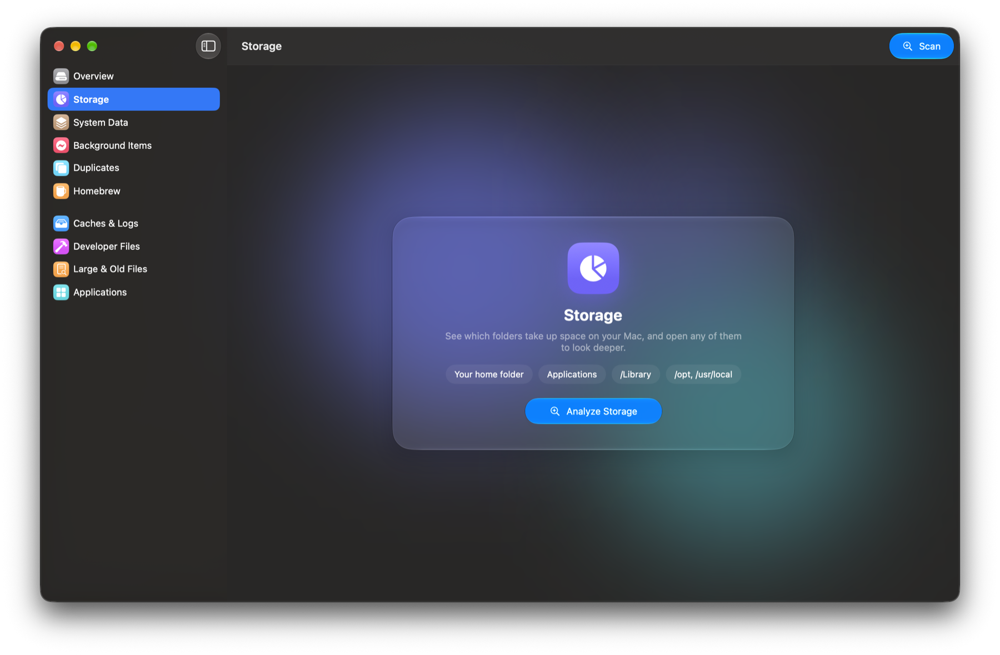

<p align="center">
  
</p>

<h1 align="center">Ferah</h1>

<p align="center">
  <strong>A free, open-source Mac cleaner and app uninstaller that shows its work.</strong><br>
  Uninstall apps with all their leftovers, see what fills your disk, clear System Data.<br>
  Nothing is deleted permanently: everything goes to the Trash.
</p>

<p align="center">
  <a href="https://github.com/vhurkus/ferah/releases/latest"></a>
  
  
  <a href="LICENSE"></a>
</p>

<p align="center">
  <a href="https://vhurkus.github.io/ferah/">Website</a> ·
  <a href="#install">Install</a> ·
  <a href="#features">Features</a> ·
  <a href="#faq">FAQ</a> ·
  <a href="https://vhurkus.github.io/ferah/tr/">Türkçe</a>
</p>

<p align="center">
  
</p>

## Install

**Homebrew**

```sh
brew install --cask vhurkus/tap/ferah
```

Update later with `brew upgrade --cask ferah`.

**Or download** the notarized DMG from [Releases](https://github.com/vhurkus/ferah/releases/latest), open it and drag Ferah to Applications. Requires macOS 15 or later.

### First launch

1. **Full Disk Access (recommended).** Without it macOS hides some folders and sizes come out smaller than they are. System Settings › Privacy & Security › Full Disk Access › turn on Ferah. The overview guides you and reopens Ferah afterwards.
2. **Allow the prompts** when they appear: controlling Finder (for items that need your password, such as App Store apps) and notifications (when an app you trash leaves files behind, or when space runs low).
3. **Scan** (⌘R). Nothing is removed until you check it and confirm.

## Features

### Uninstall apps completely



- Finds the app's containers, caches, preferences, saved state, scripts and crash reports in `~/Library`, and launch agents, daemons and helpers in `/Library`.
- Only files that provably belong to the app start checked; name-based guesses are left for you to review.
- Notices apps you drag to the Trash yourself and offers what they left behind.
- Finds leftovers of apps you removed long ago.
- Sorts apps by size or by when you last used them.

### See what fills your disk



Your home folder, apps, `/Library`, `/opt` and `/usr/local`, measured in one pass. Open any folder to look deeper and move anything to the Trash from the list.

### And more

| | |
|---|---|
| **System Data** | Time Machine local snapshots (`tmutil`), Xcode simulators (`simctl`), iPhone and iPad backups, Messages attachments |
| **Caches & logs** | App caches that rebuild themselves and old logs, each labelled with why it's safe |
| **Developer files** | Xcode DerivedData and archives, npm, pip, Yarn, Gradle, NuGet, Cargo, Go caches, `node_modules` |
| **Large & old files** | Big files anywhere in your home folder and downloads you haven't opened in months; limits in Settings |
| **Duplicates** | Byte-for-byte identical files; one copy of each always stays |
| **Background items** | Launch agents and daemons with the app they belong to; broken ones flagged; turn any off |
| **Homebrew** | Casks and formulae, updates, old versions to clean up, apps Homebrew thinks are installed but aren't |
| **Menu bar** | Free space at a glance, the Trash, and a warning when the disk is almost full |

Ferah makes no speed-up promises, doesn't "clean" memory and never removes app language files.

<p align="center">
  
</p>

## Safety

Every removal passes one policy, [`TrashPolicy.swift`](Sources/CleanerCore/TrashPolicy.swift):

- Nothing outside your home folder except third-party apps and their leftovers in `/Library`.
- Nothing in Keychains, iCloud Drive, Mail, Messages or other irreplaceable folders.
- Nothing that belongs to macOS or Apple's apps (their caches and logs aside).
- Items you can't move yourself go through Finder, which asks for your password once.
- Everything goes to the Trash; Ferah empties it only when you ask and confirm.

## FAQ

**Is it free?** Yes, MIT licensed, no subscriptions, ads or in-app purchases.

**Why not the Mac App Store?** App Store apps must be sandboxed and can't ask for administrator rights, so they can't remove leftovers or measure the whole disk. Ferah is signed with a Developer ID and notarized by Apple instead.

**How do I uninstall Ferah?** `brew uninstall --cask ferah`, or drag it to the Trash.

## Build

Needs the Command Line Tools (Xcode not required).

```sh
scripts/test.sh              # unit tests
scripts/build-app.sh debug   # build/Ferah.app
scripts/make-dmg.sh          # release DMG (set NOTARY_PROFILE to notarize)
scripts/release.sh           # notarize, publish a GitHub release and update the Homebrew tap
```

## Türkçe

Ferah, ücretsiz ve açık kaynak bir Mac temizleme ve uygulama kaldırma programıdır. Uygulamaları tüm artıklarıyla kaldırır, diski neyin doldurduğunu gösterir, Sistem Verileri'ni temizler. Bulduğu her şeyin neden güvenle silinebileceğini söyler ve hiçbir şeyi kalıcı olarak silmez; her şey Çöp Kutusu'na gider. Arayüz Türkçe ve İngilizcedir. Ayrıntılar: [Türkçe sayfa](https://vhurkus.github.io/ferah/tr/).

```sh
brew install --cask vhurkus/tap/ferah
```

## License

[MIT](LICENSE)
